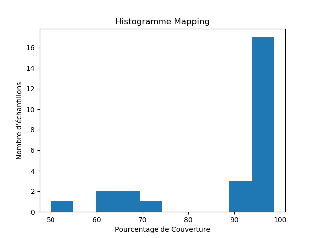
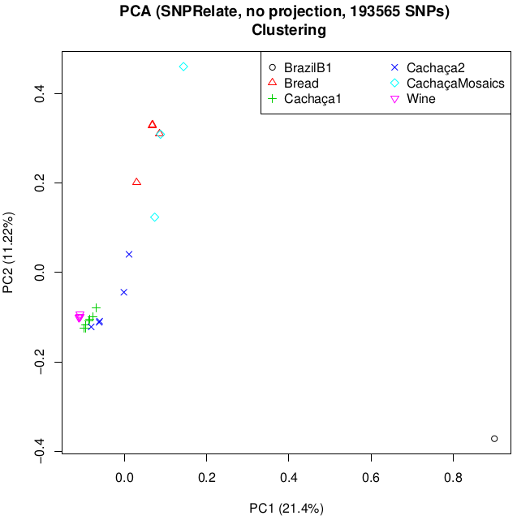

# Université Paris-Saclay - Janvier-Mai 2021

# Projet-Bioinformatique - L3 Double licence Mathématiques Informatique

## Pipeline de Préparation et d'Analyse de données de génomes 

###### George Marchment - Clémence Sebe 

## But de ce projet : 

Analyser des génomes de levures domestiquées et naturelles pour estimer l’histoire évolutive de ces dernières.

## Informations :

Nous avons conçu un pipeline de préparation et d’analyses de données. Notre script commence aux téléchargements des données et finit aux images d’analyse des données. 

Lien vers notre rapport : (à rajouter quand tout est ok)

## Résultats : 

Cette première figure a été obtenue après l’alignement des séquences. Tous les échantillons ont un pourcentage d’alignement avec le génome de référence supérieur à 50%. Comme nos séquences ont une longueur moyenne de 150 pb, ces résultats sont très satisfaisants.

Graphique représentant les vingt-six échantillons après une PCA. Chaque échantillon est représenté par un symbole et une couleur différente

Graphique représentant les vingt-six échantillons selon leur groupe d’appartenance

Arbre phylogénique de nos vingt-six échantillons avec comme couleur leur groupe caractéristique

##Conclusion : 

A partir des graphiques obtenus, nous pouvons émettre plusieurs conclusions.

La **troisième image** nous montre que les clusters (groupes de couleurs) obtenus sont plutôt bien respectés. Les levures appartenant aux groupes Wine et Cachaça1 sont toutes bien regroupées ensemble, elles forment deux clusters distincts, ces deux groupes sont très proches. Le groupe CachaçaMosaics « s’étale » un peu plus sur l’image et se mélange avec le groupe « Bread ». D’un point de vue générale, on peut conclure que les données ont été analysées correctement, on retrouve bien les données d’un même groupe ensemble.

La **dernière figure** représente l’arbre phylogénique de nos vingt-six échantillons. On observe, en premier regard, que les différents groupes ont été bien respectées (chaque couleur est regroupée). Si nous devions retracer l’évolution de ces groupes, nous pourrions supposer que le plus ancien est BrazilB1, CachaçaMosaics s’est séparée ensuite, son évolution a pris plusieurs années : Y638, Y637 et Y628 ne sont ni aux mêmes niveaux ni sur les mêmes branches. Puis sont arrivées les levures les plus récentes Cachaça1, Cachaça2 et Wine qui possèdent un ancêtre commun plus proche qu’avec  Bread qui est aussi une levure récente.

En comparant **ces deux images**, on retrouve bien ces résultats. Les groupes de Cachaça1 et Wine sont très proches  sur les deux figures. De plus, on retrouve bien un élément de CachaçaMosaics parmi les Bread. BrazilB1 est bien éloigné des autres groupes. Pour finir Cachaça2 est lui aussi bien étalé mais reste proche, et possède un plus proche ancêtre avec Wine et Cachaça1.

D'autres résultats se trouvent dans le dossier : *Resultats*

